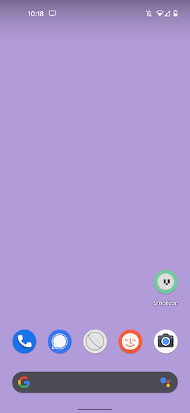
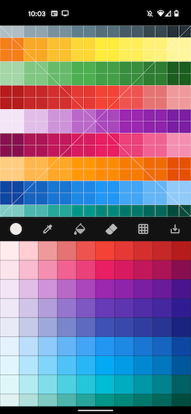
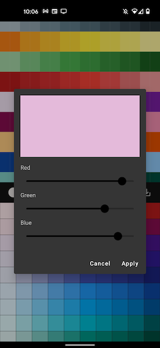

# Smolicon

&nbsp;&nbsp;&nbsp;&nbsp;&nbsp;&nbsp;&nbsp;&nbsp;&nbsp;&nbsp;

Smolicon is a 16x16 pixel painting tool for Android. It's intended for use with the [Yoto Player](https://www.yotoplay.com/) when creating custom playlists, but if you have a need for a 16x16 pixel PNG for any other purpose Smolicon should be a useful tool.

## Features

* Grid toggle
* Fill tool
* Pallette selection and colour chooser
* Pipette/Dropper pixel colour selector
* Eraser (long-press to delete entire canvas)
* Saves to a 16x16 PNG with transparancy
